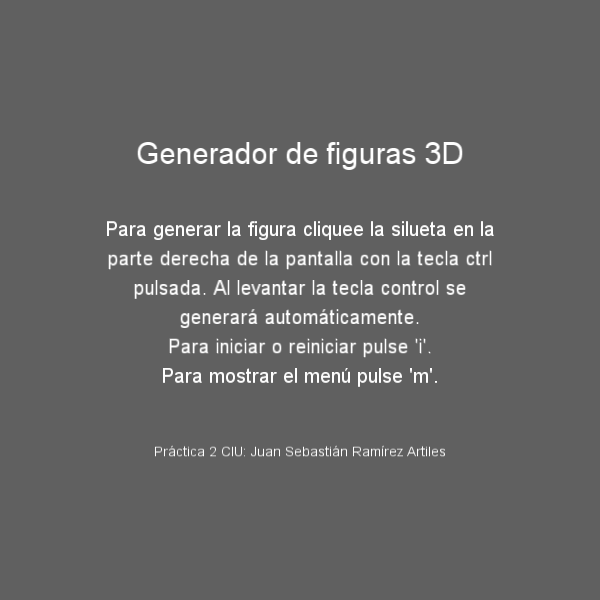

<h1>Generador de figuras 3D:</h1>

El proyecto consiste en la elaboración de un programa en Processing que genere figuras de revolución a partir de una silueta construida por pulsaciones de ratón en el margen derecho de un eje de rotación.

Para crear la silueta hay que ir uniendo puntos que serán definidos por clicks izquierdos de ratón al mismo tiempo que se mantiene polsada la tecla control. Al liberar la tecla control se generará la imagen completa. Los clicks que se den en el margen izquierdo al eje de rotación serán ignorados y no tendrán ningún efecto en la ejecución del programa.

El programa se presenta inicialmente como un menú explicativo de uso, en el que se declaran las teclas de comandos:

<ul>
	<li>La tecla 'i' inicia o reinicia el panel de edición de la figura.</li>
	<li>La tecla 'm' nos devuelve al menú inial.</li>
</ul>

	

Esta aplicación se ha desarrollado como segunda práctica evaluable para la asignatura de "Creando Interfaces de Usuarios" de la mención de Computación del grado de Ingeniería Informática de la Universidad de Las Palmas de Gran Canaria en el curso 2019/20 y en fecha de 14/2/2020 por el alumno Juan Sebastián Ramírez Artiles.
